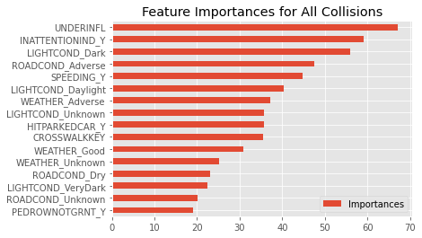
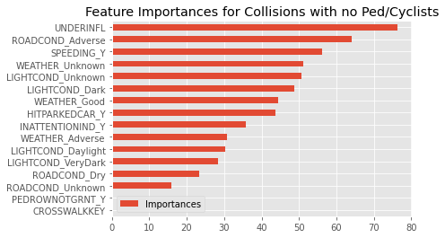

# Collisions Smollisions: 
## A Machine Learning Project and Data Analysis Project of Seattle Traffic and Collisions Data to Better Understand Why Collisions Happen

This public repository contains the Machine Learning Team's materials for the Traffic Collisions Project, organized by the Projects Circle.  

### Project Team Members
- Cindy Wong
- Isaac Campbell-Smith  
- Maureen Petterson  
- Feli Gentle  

---
## Sections:
 |  **[Introduction](#introduction)**  |
 **[Exploratory Data Analysis](#exploratory-data-analysis)**  |
 **[Probabilistic Estimating](#bayesian-approach)**  |
 **[Machine Learning I](#machine-learning-pt.-i---individual-collisions)**  |
 **[Machine Learning II](#machine-learning-pt.-ii---aggregate-annualized-features)**  |
 |  **[Conclusions & Policy Recommendations](#final-toughts)**  |
 
---

## Exploratory Data Analysis

Seattle is a bustling metropolis with thriving public transportation and a purpotedly bike-friendly commuting infrastructure. Though the city's rate of traffic collisions is about 30 per day, it's been trending downward. There were 11,186 collisions last year vs over 30,000 collisions between 2005 & 2006. Seattle has seen a steady decline in annual collisions since 2015 though the argument could be made that numbers would have trended downward much earlier if not for the rise of mobile phones and distracted driving.  

The dramatic increase in reported collisions with distracted drivers from 2013-15 points to a common theme in the data quality available to us - how much are the features being influenced by external forces or simple human error? Our research was inconclusive but it's possible that the sudden rise in collisions related to distracted driving has more to do with police aggresively investigating cases or casting a wider net to include such cases.

For more a more in-depth overview of the technical and statistical components of the datasets, checkout this notebook: 
https://github.com/DataCircles/traffic_collisions_ml_team1/blob/master/notebooks/data_report.ipynb

---

## Bayesian Approach

Though there is a large degree of randomness underlying our data in this inherently random human phenomenon, we suspected that the general trends in collisions suggest one or more switchpoints in the rate of collisions. We turned to the PyMC3 library to to get a better understanding of the true probability of a collision.

---
## Machine Learning Pt. I - Individual Collisions

Our first approach to learning from these datasets was to look at as many features as possible on each collision to see what were the strongest indicators of whether it would lead to injuries. While this approach does bring some serious data leakage into the mix, we still felt it might still provide insights. 

LightGBM was the model we opted for here because it can handle categorical features under the hood without needing to one-hot-encode any columns. We also wanted to see if pedestrian/cyclist-involved accidents would produce different results. Even after tuning hyperparameters, the results aren't performing much better than guesswork and the feature importances amount to a common sense intuition of why injuries might occur in traffic collisions. Whether drugs or alcohol are present, lack of attention, and night-time lighting are important features for this model's predictive power. 

<table>
    <tr>
        <td></td>
        <td></td>
    </tr>
    <tr>
        <td></td>
        <td></td>
</table>   

That drugs/alcohol-caused collisions have kept remarkably steady since 2005 is somewhat telling - about 500 per year. It's completely possible that current actions in place to combat driving under-the-infulence are keeping them at this rate, it seems clear that a different (likely harsher) approach is needed to get those numbers down.

---

## Machine Learning Pt. II - Aggregate Annualized Features

Our second approach was to aggregate the Seattle Streets dataset and apply machine learning to predict annual number of accidents on features: transit class, slope percentage, speed limit, arterial class and average daily traffic counts. For intersections data, we only used signal type, arterial class and traffic circle. 

We used CatBoost for this approach because it's Gradient Boosted Random Forest Algorithm is similar to LightGBM but it can handle strings categorically (LightGBM can only interpret integers). As with the previous approach, the results leave a lot to be desired. For collisions not occuring at intersections, speed limit, traffic flow and slope percentage about equally weighted the models predictions. Introducing the number of traffic circles did not provide any more predictive power, most likely owing to it being a feature almost exclusively existing on non-arterial residential streets. 

---
## Final Thoughts