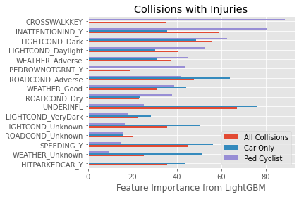
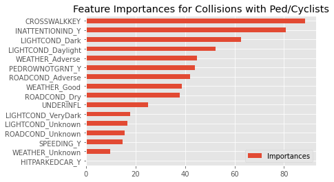

# Collisions Smollisions: 
## A Machine Learning Project and Data Analysis Project of Seattle Traffic and Collisions Data to Better Understand Why Collisions Happen

This public repository contains the Machine Learning Team's materials for the Traffic Collisions Project, organized by the Projects Circle.  

### Project Team Members
- Cindy Wong
- Isaac Campbell-Smith  
- Maureen Petterson  
- Feli Gentle  

---
## Sections:
 |  **[Introduction](#introduction)**  |
 **[Exploratory Data Analysis](#exploratory-data-analysis)**  |
 **[Probabilistic Estimating](#bayesian-approach)**  |
 **[Machine Learning I](#machine-learning-pt.-i---individual-collisions)**  |
 **[Machine Learning II](#machine-learning-pt.-ii---aggregate-annualized-features)**  |
 |  **[Conclusions & Policy Recommendations](#final-toughts)**  |
 
---

## Exploratory Data Analysis

Seattle is a bustling metropolis with thriving public transportation and a purpotedly bike-friendly commuting infrastructure. Though the city's rate of traffic collisions is about 30 per day, it's been trending downward. There were 11,186 collisions last year vs over 30,000 collisions between 2005 & 2006. Seattle has seen a steady decline in annual collisions since 2015 though the argument could be made that numbers would have trended downward much earlier if not for the rise of mobile phones and distracted driving.  

The dramatic increase in reported collisions with distracted drivers from 2013-15 points to a common theme in the data quality available to us - how much are the features being influenced by external forces or simple human error? Our research was inconclusive but it's possible that the sudden rise in collisions related to distracted driving has more to do with police aggresively investigating cases or casting a wider net to include such cases.

For more a more in-depth overview of the technical and statistical components of the datasets, checkout this notebook: 
https://github.com/DataCircles/traffic_collisions_ml_team1/blob/master/notebooks/data_report.ipynb

### Alcohol Use

That drugs/alcohol-caused collisions have kept remarkably steady since 2005 is somewhat telling - about 500 per year. It's completely possible that current actions in place to combat driving under-the-infulence are keeping them at this rate, it seems clear that a different (likely harsher) approach is needed to get those numbers down.

### Pedestrians and Cyclists
Additionally, we noted that the rate of injuries in collisions involving pedestrians and cyclists was quite high: 90% of those collisions resulted in an injury, compared to just 27% injury rate in collisions not including pedestrians of cyclists. 

Looking at a bar chart of the features present in both pedestrian/cyclist collisions vs collisions without pedestrians/cyclists already builds an intution for what features the model will likely deem important. 

---

## EDA of Additional Datasets

Since the main collisions data only contains locations that had a collision, we decided to look for what is NOT there. We sought out other data that might be able to help us fill in the gap. We obtained Seattle Streets data which are all the blocks, Intersections data, Traffic Circles data and Crosswalks data.

Using a complete list of each those locations along more detailed features, we can merge it with the collisions data to have locations with and without collisions together.

### Blocks

Over the years, about 72.5% of the blocks recorded has had at least one collision.
Looking the blocks data, there are 3 columns that seem like it could have significance: speed limit, slope percentage and artdescript (label of type of arterial road). We found that most blocks are categorized as some type of neighborhood street and thus a large number of them have pretty low speed limits- about 87% is less than 30mph.

A deeper look into the slope percentage and we discovered that the average slope of the top 10 blocks with the highest amount of collisions is about 1.4% while the bottom 10 blocks are higher at 3.8%.

While the dataset mostly contains blocks that are not an arterial road, the blocks with the highest collisions are basically all classified as arterial types. If we take a look at the types of arterial description of collisions vs non-collisions, we can see that most major roads fell in the category of collisions:

---

## Bayesian Approach

Though there is a large degree of randomness underlying our data in this inherently random human phenomenon, we suspected that the general trends in collisions suggest one or more switchpoints in the rate of collisions. We turned to the PyMC3 library to to get a better understanding of the true probability of a collision.

---
## Machine Learning Pt. I - Individual Collisions

Our first approach to learning from these datasets was to look at as many features as possible on each collision to see what were the strongest indicators of whether it would lead to injuries. While this approach does bring some serious data leakage into the mix, we still felt it might still provide insights. 

LightGBM was the model we opted for here because it can handle categorical features under the hood without needing to one-hot-encode any columns. We also wanted to see if pedestrian/cyclist-involved accidents would produce different results. Even after tuning hyperparameters, the AUC was only 0.64 and the feature importances amount to a common sense intuition of why injuries might occur in traffic collisions. Whether drugs or alcohol are present, lack of attention, and night-time lighting are important features for this model's predictive power. 

Most notable is the difference of important features in the collisions involving pedestrians and cyclists. The influence of alcohol becomes far less important than presence of a crosswalk key and inattention. 

<table>
    <tr>
        <td></td>
        <td></td>
    </tr>
    <tr>
        <td></td>
        <td></td>
</table>   

---

## Machine Learning Pt. II - Aggregate Annualized Features

Our second approach was to aggregate annual collision counts on the Seattle Streets and Intersections datasest and apply machine learning to predict annual number of accidents on meta features: transit class, slope percentage, speed limit, arterial class and average daily traffic counts for streets; signal type, arterial class and traffic circle (yes/no) for intersections. We used CatBoost for these models because it's Gradient Boosted Random Forest Algorithm is similar to LightGBM but it can handle strings categorically (LightGBM can only interpret integers). It's important to note that the Streets dataset contains multiple iterations of many streets (i.e. 1st Ave N between Broadway and Cherry, 1st Ave N between Pine and Yesler). We did not determine the time it would talk to meticulously map each collision to a particular street segment was a constructive use of time considering all other ML problems in the data, so the median values of the aforementioned features were taken for each named street. The intersections data does not have the same problem, but there are fewer features to study. Ultimately this effort was meant to inform further data analysis and supplement findings therein as the algorithm itself lends little to shape policy. 

For collisions not occuring at intersections, speed limit, traffic flow and slope percentage about equally weighted the models predictions. 

  
Our interpretation of this modelling is that, at least on a 'block' level, the sheer volume of traffic will lead to certain numbers of collisions regardless of street features. Though speed limit and slope seem to significantly guide the decision tree splitting as well, it's unlikely to reduce speed limits on faster thoroughfares while mass modification of street slops is close to impossible. The only official recommendation we can make to the city here is make an effort to capture more informative mapping data in incident reports and nuance the Streets metadata further. For example, lane width is a feature included in their dataset, but there is no mention of lane counts. We suspect that space allotted to vehicles is correlated with lower collision rates, the data readily available does not provide this information.  

For collisions occuring at intersections, the results intially appeared more fruitful. Signal type is clearly more important here than arterial class here, and even more important for collisions involving pedestrians and/or cyclists. Introducing whether or not an intersection had traffic circles did not provide any more predictive power, most likely owing to it being a feature almost exclusively existing on non-arterial residential streets.

<table>
    <tr>
        <td></td>
        <td></td>
    </tr>
</table>   
<table><tr><td>
</td></tr></table>  
  
It looks like Seattle's 2030 plan to install a lot of pedestrian-first traffic lights seems like an intelligent allocation of resources. Though the distribution of signal types outside of 'City' & 'None' is minimal across Seattle for a proper Machine Learning model, the higher rate at 'State' intersections would not take too many resources to resolve (there are only 31 reported intersections with this signal type). These all fall around highway ramps and we'd suggest making modifications to make traffic signals clearer there. For a more thorough data report on annual collision rates vs different intersection features, checkout this Tableau Dashboard Isaac put together here:
https://public.tableau.com/profile/isaac.campbell.smith#!/vizhome/SeattleIntersections/TrafficCirclesAccidentRatesNon-Arterial

---
## Final Thoughts