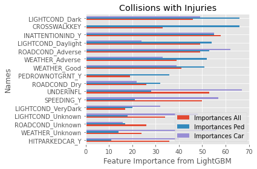
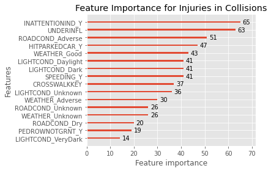
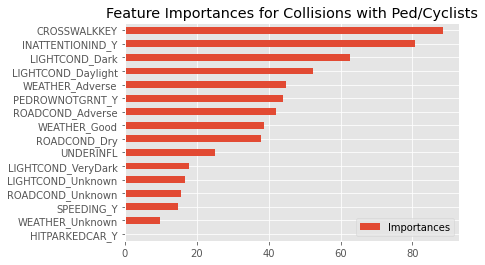
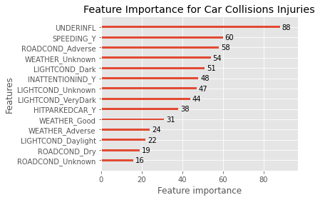

## Weekly updates for stand-up

### Week 1
Presenter: Maureen

### Week 2
Presenter: Cindy

### Week 3
Presenter: Isaac

### Week 4:
Presenter: Feli

### Week 5
Presenter: Maureen

Completed tasks for this week:

1. Expanded from last week's model to look at pedestrian & cyclist collisions that resulted in injuries and extracted important features.

- Note that collisions involving pedestrians and cyclists account for ~7% of the reports in the cleaned dataset. 
- 31% of all collisions resulted in at least 1 injury (injury/serious injury/fatality).
- 90% of collisions involving pedestrians or cyclists resulted in an injury.
- 27% of collisions NOT involving pedestrians or cyclists resulted in an injury.

2. Combined Intersections and Traffic Flow data with Collisions data. 

3. Developed aggregate data model, predicting annual collisions, to look at intersections rather than streets

- Usable features are harder to come by but seeing the importance of traffic signal type (especially for pedestrian/cyclist collisions) is telling

  

 

### Miscellaneous Analysis discoveries on merged WSDOT dataset

- <b>1.</b> 65+ year-old drivers have not contributed to the overall decrease in traffic collisions. 

16-25 year-old drivers and 25-65 year-old drivers show a roughly equal proportionate decrease in collisions. 
True number of drivers in each bracket would be needed for a better understanding.

 
Tableau chart: https://public.tableau.com/profile/isaac.campbell.smith#!/vizhome/SeattleTrafficCollisions_15971158097880/AgeGroups

- <b>2.</b> Annual drunk driving collisions have been remarkably consistent since 2005. 
Considering all the resources that go into preventing and advertising against drunk driving, it may be worth finding newer creative options or harsher p enalties. 

 
Tableau chart: https://public.tableau.com/profile/isaac.campbell.smith#!/vizhome/SeattleTrafficCollisions_15971158097880/DrunkDriving

- <b>3.</b> Data suggests a decrease in collisions from 2012-2015 if it weren't for a dramatic increase in 'distracted driving'

 
Tableau chart: https://public.tableau.com/profile/isaac.campbell.smith#!/vizhome/SeattleTrafficCollisions_15971158097880/Distracted

Also implemented different models to see how they compared (LightGBM, Catboost, RandomForest)