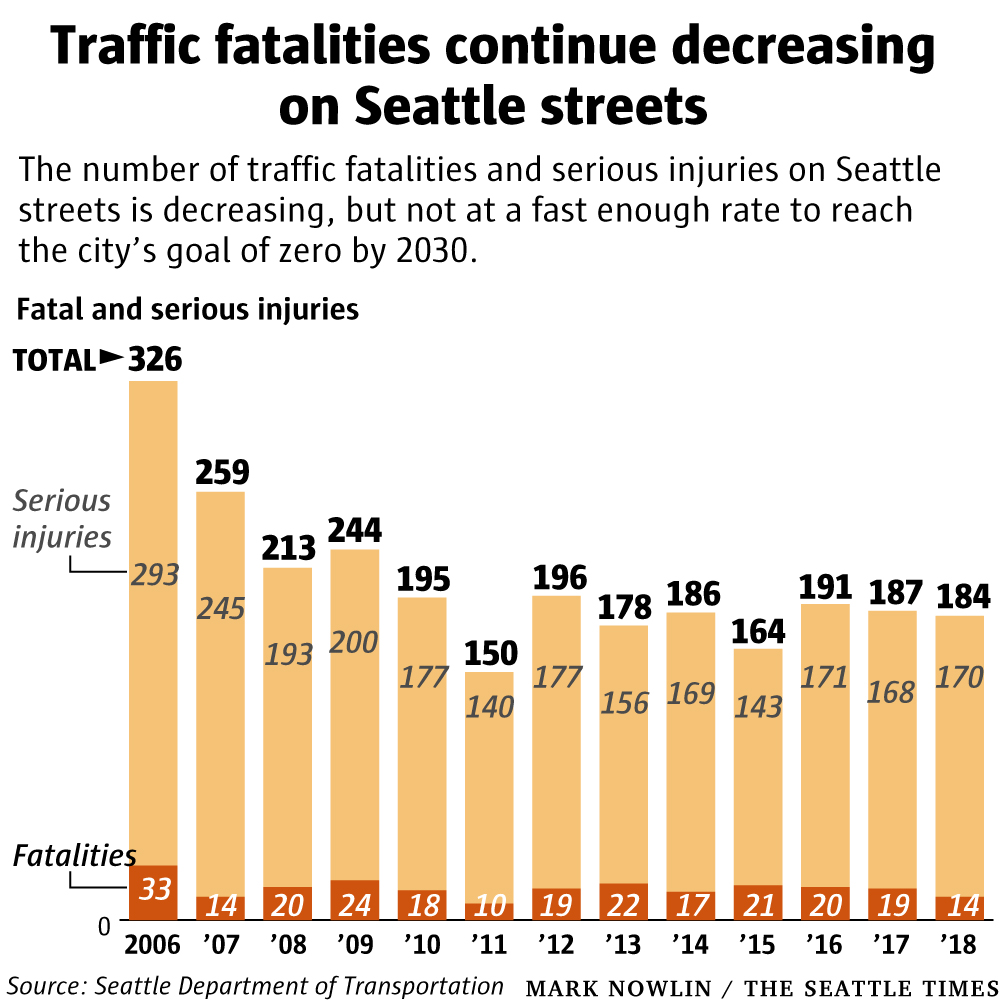

# Seattle Traffic Policy Briefing

## Policy briefing

**Policy Event** In 2017, electronic gadgets (phones, tablets, laptops, gaming devices) forbidden behind the wheel, including stop signs or red-light signals

**Policy Event** Increase 'Emphasis Patrols' to enforce traffic laws and reduce distracted driving (Summer 2019)

**Policy Event** SDOT implementing pedestrian prefered crosswalks (pedestrians get a head start of 3-7 seconds when the light changes to green), 43 installed by March 11, with plans for 140 more (at the time), considered a cost effective and successful example in NYC which is considered to reduce pedestrian and bicycle injuries by 40% in NYC

**Policy Event** Feb 2020, [Phase 2](https://www.seattle.gov/visionzero/projects/rainier-ave-s) of improving safety and bus reliability on Rainier Ave S ([article](https://sdotblog.seattle.gov/2020/02/25/rainier-traffic-safety-campaign/))

- improved traffic signal at Rainier Ave S and S Rose St, adding red bus lanes, and a center turn lane
- education campaign to encourage safe driving

# Focusing our research

# Vision Zero 2030

"The number of traffic fatalities and serious injuries in Seattle dipped  only slightly last year from the previous year, leaving the city far  from meeting its [goal](https://www.seattle.gov/visionzero) of eliminating all such deaths and injuries by 2030."

[News Article](https://www.seattletimes.com/seattle-news/transportation/seattle-traffic-deaths-and-injuries-down-slightly-last-year-most-of-the-fatalities-were-pedestrians/) March 11, 2019, Seattle Times 

2006 considered the earliest year with complete data for fatalities and injuries from traffic collisions.

Seattle's Vision Zero goal (achieve zero fatalities and serious injuries by 2030 'through lower speed limits and redesigned roadways, among other strategies...adopted by Seattle in 2015')

“It’s up to us in the city to design  streets so that when someone inevitably makes a mistake, the  consequences aren’t death,” said Curtin, who manages SDOT’s Vision Zero  program.

### Policy Research Assessment

#### Broad Questions

Are Vision Zero Initiative changes reducing injury/fatalities?

#### Hypotheses

Null Hypothesis: fatalities and injuries from traffic collisions have remained since 2015 despite an increase in safety features implemented from the Vision Zero initiative.

Alternative Hypothesis : fatalities and injuries from traffic collisions have reduced since 2015 during an increase in new features implemented from the Vision Zero initiative.

**Research questions:** 

what safety features have been implemented and do the data reflect this? Where?

Do we see a change in injury and fatality in these areas?

- metrics:
  - rate of collision
    - total
    - normalized for traffic volume
  - rate of injury, i.e. out of all collisions how often did they result in injury
    - various injury classification
  - rate of fatality, i.e. out of all injuries, how often did they result in fatality
  - ???

---

# Highlight on Rainier Corridor

Criticism from delayed safety improvements on Rainier Avenue South (which at the time of the article, had recent fatality and 2 injuries)

[2018 article](https://www.seattletimes.com/seattle-news/transportation/safety-improvements-coming-to-rainier-avenue-where-2-girls-were-hit-by-car-this-month/) : "A crash per day occurs in the southern Rainier corridor, double the rate of other major arterials, city data show."

Rainier Corridor Project proposal to: slow traffic, redesign parts of the street, shortening crosswalks for pedestrians

SDOT highlights distracted driving, impairment, speeding and failure to yield to pedestrians as contributors to the deaths and serious injuries, echoed in 2017 Vision Zero report

### Policy Research Assessment

#### Broad Questions

Does the data show distracted driving, impairment, speeding, and failure to yield to pedestrians contribute to deaths and serious injuries?

What available data reflects recorded distracted driving, impairment, speeding, failure to yield?

Do injurious/fatal collisions have higher rates of recorded distracted driving, impairment, speeding, failure to yield?

#### Hypotheses

**Null Hypothesis**:

Impairment is not higher in injurious/fatal

**Alternative Hypothesis**:

#### Research questions

---

# Improving streets only based on fatality and serious injury

- using intersection of footage to assess traffic patterns using computer vision [(article)](https://www.seattletimes.com/seattle-news/transportation/bellevue-uses-ai-technology-to-identify-problem-intersections-and-make-them-safer/)
- 

### Policy Research Assessment

#### Broad Questions

Does the data show distracted driving, impairment, speeding, and failure to yield to pedestrians contribute to deaths and serious injuries?

What available data reflects recorded distracted driving, impairment, speeding, failure to yield?

Do injurious/fatal collisions have higher rates of recorded distracted driving, impairment, speeding, failure to yield?

#### Hypotheses

**Null Hypothesis**:

**Alternative Hypothesis**:

#### Research questions

New data collection policy suggestion